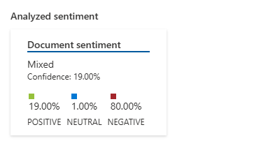
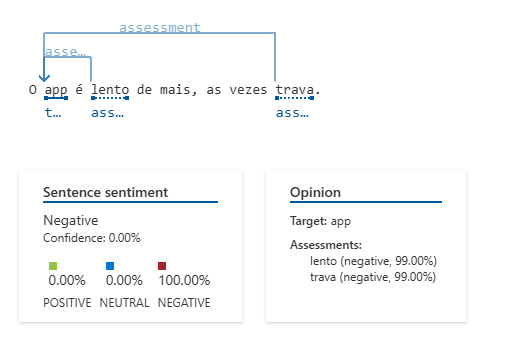

### **Guia: Análise de Sentimentos com Azure Cognitive Services a Partir de um Arquivo Local**

Este guia descreve como realizar a análise de sentimentos de um texto armazenado localmente, utilizando o Azure Cognitive Services. O texto analisado é um comentário público sobre o aplicativo **Solar Coca-Cola**, extraído da Google Play.

---

### **Passo 1: Estrutura do Projeto**

1. **Diretório de Trabalho**
   - O texto está armazenado no diretório `inputs` com o nome do arquivo `Francisco-Assis.txt`.

2. **Conteúdo do Arquivo**
   - O arquivo contém o seguinte texto:
     ```plaintext
     Pode melhorar muito, Os produtos estão embaralhados fazendo que perca muito tempo nos pedidos. 
     O app é lento demais, às vezes trava. 
     Se por acaso o cliente errar o pedido e finalizar, o mesmo tem até a opção de cancelar o pedido. 
     Porém não cancela e no dia seguinte o pedido chega. 
     SAO ESSES OS PONTOS NEGATIVOS QUE COMO CLIENTE DA COCA COLA VEJO AO USAR O APP. 
     Funciona, mas tem potencial para melhorar muito ainda.
     ```

---

### **Passo 2: Configurar o Serviço Text Analytics no Azure**

#### **1. Criar o Recurso**
1. No [Portal Azure](https://portal.azure.com/), crie um recurso **Text Analytics**.
2. Após a criação, obtenha:
   - **Subscription Key**: Sua chave de assinatura.
   - **Endpoint**: URL do endpoint do serviço.
   - **Region**: Região selecionada (ex.: `eastus`).

---

### **Passo 3: Código para Análise**

A seguir, o código para ler o texto do arquivo local, enviá-lo para o Azure Text Analytics e processar os resultados.

```python
import os
import requests
import json

# Configurações do Azure
AZURE_REGION = "sua-regiao"  # Ex.: "eastus"
AZURE_SUBSCRIPTION_KEY = "sua-chave-de-assinatura"
AZURE_ENDPOINT = f"https://{AZURE_REGION}.api.cognitive.microsoft.com/text/analytics/v3.1/sentiment"

# Caminho do arquivo de entrada
INPUT_DIR = "inputs"
FILE_NAME = "Francisco-de-Assis.txt"
FILE_PATH = os.path.join(INPUT_DIR, FILE_NAME)

# Função para ler o texto do arquivo
def read_text_from_file(file_path):
    with open(file_path, "r", encoding="utf-8") as file:
        return file.read()

# Função para enviar o texto para o Azure
def analyze_sentiment(text, region, subscription_key, endpoint):
    # Dados para envio
    data = {
        "documents": [
            {"id": "1", "language": "pt", "text": text}
        ]
    }

    # Cabeçalhos da requisição
    headers = {
        "Ocp-Apim-Subscription-Key": subscription_key,
        "Content-Type": "application/json"
    }

    # Enviando requisição POST
    response = requests.post(endpoint, headers=headers, json=data)

    # Verificar resposta
    if response.status_code == 200:
        return response.json()
    else:
        return {"error": response.json()}

# Executando o fluxo
try:
    # Passo 1: Ler texto do arquivo
    text = read_text_from_file(FILE_PATH)
    print("Texto lido do arquivo:")
    print(text)

    # Passo 2: Enviar texto para o Azure
    analysis_result = analyze_sentiment(text, AZURE_REGION, AZURE_SUBSCRIPTION_KEY, AZURE_ENDPOINT)

    # Exibir resultado da análise
    print("\nResultado da análise de sentimentos:")
    print(json.dumps(analysis_result, indent=2, ensure_ascii=False))
except Exception as e:
    print(f"Erro durante o processo: {e}")
```

---

### **Passo 4: Interpretação dos Resultados**

1. **Sentimento Geral**:
   - `"sentiment": "mixed"` (Misto): O texto contém opiniões tanto positivas quanto negativas.
   
2. **Confiança do Sentimento**:
   - Positivo: `0.19`
   - Neutro: `0.01`
   - Negativo: `0.8`

3. **Detalhes das Frases**:
   - Frases negativas, como: 
     - `"Pode melhorar muito, Os produtos estão embaralhados..."`
     - `"O app é lento demais, às vezes trava."`
   - Frase positiva:
     - `"Funciona, mas tem potencial para melhorar muito ainda."`

---


**Exemplo de Resultado Geral**



**Exemplo de Resultado Detalhado**




### **Passo 5: Revisando o Resultado Analisado**

Após realizar a análise, você pode acessar o resultado retornado pelo Azure. Aqui está o conteúdo do arquivo JSON gerado pela análise de sentimento:

```json
{
    "documents": [
        {
            "id": "id__1948",
            "sentiment": "mixed",
            "confidenceScores": {
                "positive": 0.19,
                "neutral": 0.01,
                "negative": 0.8
            },
            "sentences": [
                {
                    "sentiment": "negative",
                    "confidenceScores": {
                        "positive": 0.01,
                        "neutral": 0,
                        "negative": 0.99
                    },
                    "offset": 0,
                    "length": 95,
                    "text": "Pode melhorar muito, Os produtos estão embaralhados fazendo que perca muito tempo nos pedidos. ",
                    "targets": [],
                    "assessments": []
                },
                {
                    "sentiment": "negative",
                    "confidenceScores": {
                        "positive": 0,
                        "neutral": 0,
                        "negative": 1
                    },
                    "offset": 95,
                    "length": 39,
                    "text": "O app é lento de mais, as vezes trava. ",
                    "targets": [
                        {
                            "sentiment": "negative",
                            "confidenceScores": {
                                "positive": 0.01,
                                "negative": 0.99
                            },
                            "offset": 97,
                            "length": 3,
                            "text": "app",
                            "relations": [
                                {
                                    "relationType": "assessment",
                                    "ref": "#/documents/0/sentences/1/assessments/0"
                                },
                                {
                                    "relationType": "assessment",
                                    "ref": "#/documents/0/sentences/1/assessments/1"
                                }
                            ]
                        }
                    ],
                    "assessments": [
                        {
                            "sentiment": "negative",
                            "confidenceScores": {
                                "positive": 0.01,
                                "negative": 0.99
                            },
                            "offset": 103,
                            "length": 5,
                            "text": "lento",
                            "isNegated": false
                        },
                        {
                            "sentiment": "negative",
                            "confidenceScores": {
                                "positive": 0.01,
                                "negative": 0.99
                            },
                            "offset": 127,
                            "length": 5,
                            "text": "trava",
                            "isNegated": false
                        }
                    ]
                },
                {
                    "sentiment": "negative",
                    "confidenceScores": {
                        "positive": 0,
                        "neutral": 0,
                        "negative": 1
                    },
                    "offset": 134,
                    "length": 97,
                    "text": "Se por acaso o cliente errar o pedido e finalizar, o mesmo tem até a opção de cancelar o pedido. ",
                    "targets": [],
                    "assessments": []
                },
                {
                    "sentiment": "negative",
                    "confidenceScores": {
                        "positive": 0.01,
                        "neutral": 0,
                        "negative": 0.99
                    },
                    "offset": 231,
                    "length": 131,
                    "text": "Porém não cancela e no dia seguinte o pedido chega SAO ESSES OS PONTOS NEGATIVOS QUE COMO CLIENTE DA COCA COLA VEJO AO USAR O APP. ",
                    "targets": [],
                    "assessments": []
                },
                {
                    "sentiment": "positive",
                    "confidenceScores": {
                        "positive": 0.95,
                        "neutral": 0.05,
                        "negative": 0
                    },
                    "offset": 362,
                    "length": 54,
                    "text": "Funciona, mas tem potencial para melhorar muito ainda.",
                    "targets": [],
                    "assessments": []
                }
            ],
            "warnings": []
        }
    ],
    "errors": [],
    "modelVersion": "2024-03-01"
}
```
### **Aplicações e Contexto**

1. **Origem do Texto**:
   - Este texto é um comentário público sobre o aplicativo disponível na Google Play Store.

2. **Possíveis Aplicações desta Feature**:
   - Melhorar a experiência do usuário com base nos feedbacks negativos.
   - Destacar aspectos positivos nas comunicações de marketing.
   - Análise contínua para monitorar a percepção dos usuários.

---

